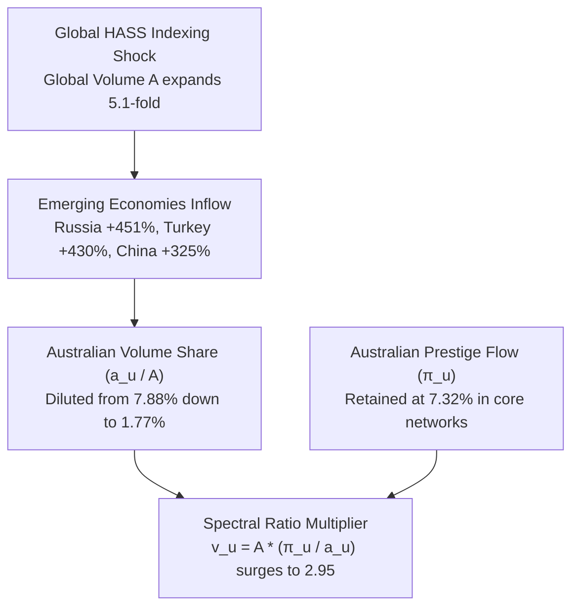

# Global Spectral Ranking Comparative Study: ERA 2018 vs. ERA 2026

**Authors / Investigation:** Pair Programming Analysis with Antigravity AI  
**Scope:** ANZSRC FoR 2008 (Divisions 01–22) & Global Bipartite Networks  
**Windows:** ERA 2018 Emulation (2011–2016) vs. ERA 2026 Emulation (2020–2025)  
**Corpora:** OpenAlex / CWTS Leiden Ranking Open Edition (1,506 Curated Global Universities across 72 Countries)  
**Primary Artifacts:** 
* [`sources_vs_institutions_comparison.csv`](file:///home/lc/s/SpectralRankingGlobal_WORKING_jul26/era2026/sources_vs_institutions_comparison.csv)
* [`all_leiden_countries_era_comparison.csv`](file:///home/lc/s/SpectralRankingGlobal_WORKING_jul26/era2026/all_leiden_countries_era_comparison.csv)
* [`hass_share_by_year_and_country.csv`](file:///home/lc/s/SpectralRankingGlobal_WORKING_jul26/era2026/hass_share_by_year_and_country.csv)
* [`hass_growth_summary.csv`](file:///home/lc/s/SpectralRankingGlobal_WORKING_jul26/era2026/hass_growth_summary.csv)
* [`era2018_vs_era2026_matched_comparison.csv`](file:///home/lc/s/SpectralRankingGlobal_WORKING_jul26/era2026/hep_reports/era2018_vs_era2026_matched_comparison.csv)

---

## Executive Summary

Between the **ERA 2018 emulation (2011–2016)** and the **fictional ERA 2026 update (2020–2025)**, Australian university spectral performance scores ($v$) exhibited a dramatic upward shift:
* **Australian National Mean $v$:** Rose from **0.921 $\to$ 1.530** (+66.1%).
* **Proportion Above World Standard ($v \ge 1.0$):** Surged from **39.7% $\to$ 82.0%** (+42.3 percentage points).

This comparative investigation demonstrates that:
1. **The shift is not an artifact of citation maturity:** Both runs utilized closed, synchronous 6-year citation windows ($T_{\text{citer}} = T_{\text{cited}}$).
2. **The global threshold is conserved:** Globally, the proportion of institutions meeting world standard remained rock-solid at **26.8% (2018) vs. 27.0% (2026)**.
3. **Australia is part of a broader Western OECD / Anglosphere structural pattern:** UK universities rose from 62.7% $\to$ 84.9% $\ge 1.0$; US from 68.3% $\to$ 81.2%; Netherlands from 77.8% $\to$ 87.9%; Sweden from 54.1% $\to$ 84.3%; New Zealand from 35.6% $\to$ 66.1%; and Singapore reached a world-leading 95.6%.
4. **The fundamental engine is the Global HASS Indexing Shock:** Australia already had a mature, high-share Humanities, Arts, and Social Sciences (HASS) output base (~29% of national volume in 2011–2016 vs. 21% globally and 7% in China). Between 2016 and 2025, open indexing and publication in emerging economies exploded (+300% to +450% in Russia, Turkey, China, and India).
5. **The Spectral Invariant ($v_u = A \cdot \frac{\pi_u}{a_u}$):** As newly indexed emerging volume diluted Australia's share of global publication count ($a_u$), Australia's share of global citation prestige ($\pi_u$) remained deeply anchored in core English-language networks. Consequently, the prestige-to-volume ratio ($\pi_u / a_u$) inflated massively in HASS divisions (Education: $\bar{v} = 1.12 \to 2.95$; Human Society: $1.08 \to 2.14$), driving the national aggregate upward.

---

## 1. Sources (Journals) vs. Institutions Over Time

A fundamental question in bipartite spectral ranking is how the two partitions of the graph—**Institutions ($U$)** and **Sources / Journals ($S$)**—evolved across the evaluation eras.

```mermaid
graph LR
    subgraph ERA 2018 (2011-2016)
        U18["31,754 Institution-Field Pairs<br/>(Avg 3.09 Fields / Univ)"]
        S18["27,742 Journal-Field Pairs<br/>(Avg 1.67 Fields / Journal)"]
    end
    subgraph ERA 2026 (2020-2025)
        U26["55,500 Institution-Field Pairs<br/>(+74.8% Growth | Avg 3.63 Fields)"]
        S26["44,917 Journal-Field Pairs<br/>(+61.9% Growth | Avg 1.77 Fields)"]
    end
    U18 -->|Diversification across fields| U26
    S18 -->|Volume Fattening + Title Growth| S26
```

### 1.1 Macro Growth Rates

| Aggregation Level | Entity Type | ERA 2018 (2011–2016) | ERA 2026 (2020–2025) | Growth (%) |
| :--- | :--- | :---: | :---: | :---: |
| **Field-Level Pairs** *(Evaluated in rankings)* | **Institutions ($N_U$)** | **31,754** | **55,500** | **+74.8%** |
| | **Sources / Journals ($N_S$)** | **27,742** | **44,917** | **+61.9%** |
| | *Ratio ($N_U / N_S$)* | *1.14* | *1.24* | *+8.8%* |
| **Global Unique Entities** *(Crossing $\tau$ in $\ge 1$ FoR)* | **Institutions** | **10,274** | **15,287** | **+48.8%** |
| | **Sources / Journals** | **16,595** | **25,385** | **+53.0%** |
| **Raw Global Candidates** *(Any publication in corpus)* | **Institutions** | **50,636** | **54,699** | **+8.0%** |
| | **Sources / Journals** | **59,779** | **99,756** | **+66.9%** |

### 1.2 Structural Mechanism: Institutional Diversification vs. Journal Fattening

1. **Multidisciplinary Diversification of Universities:**
   * Universities are composite entities. As global research output grew, existing universities crossed the Low Volume Threshold ($\tau_u = 50$ works over 6 years) in far more disciplines than before.
   * Average active divisions per institution rose from **3.09 to 3.63 (+17.5%)**.
   * Consequently, institution-field pairs surged by **+74.8%**, far outstripping the growth in unique universities (+48.8%).
2. **Domain-Bound Journals & "Fattening":**
   * Journals remained disciplinary specialists: divisions per journal barely changed (**1.67 $\to$ 1.77, +6.0%**).
   * Journals absorbed output expansion by publishing more papers per title (open access expansion, mega-journals, and special issues). Mean journal activity ($a_s$) grew by **+39.0%** in Environmental Sciences, **+27.5%** in Earth Sciences, and **+24.2%** in Engineering.
3. **Conservation of Source Prestige:**
   * Across all fields, the proportion of journals with $v_s \ge 1.0$ remained stable at **~34% in 2018 vs. ~33% in 2026**, confirming that spectral normalization strictly conserves global influence.

---

## 2. Global University Benchmark: The CWTS Leiden Universe (1,506 Universities Across 72 Countries)

### 2.1 The Methodological Challenge: Identifying "Universities"

In Australia, ERA evaluates statutory Higher Education Providers (HEPs) listed in [`HEP_concordances.xlsx`](file:///home/lc/Projects_Antigravity/SpectralRankingGlobal/data/HEP_concordances.xlsx). Internationally, defining "what counts as a university" is complicated by:
* National research agencies (e.g., CNRS in France, Max Planck in Germany, CAS in China, CSIR in India, Fiocruz in Brazil).
* Separate university hospital networks.
* Non-research community colleges and theological seminaries.

To establish an internationally standardized benchmark, we mapped our global rankings to the **CWTS Leiden Ranking Open Edition universe** (`university.tsv`), which curates **1,506 premier research universities** across 72 countries. All 1,506 universities match 1-to-1 with our OpenAlex database via ROR identifiers.

```
Total Global Leiden Universities:  1,506
Evaluated Discipline Units (2018): 15,321
Evaluated Discipline Units (2026): 19,452 (+27.0%)
Global Leiden Mean v (2018):       0.811
Global Leiden Mean v (2026):       1.011 (+0.200)
Global Leiden % >= 1.0 (2018):     31.7%
Global Leiden % >= 1.0 (2026):     42.4% (+10.7 pp)
```

### 2.2 Comprehensive International Comparison Table

The table below benchmarks all major national systems (ordered by 2026 evaluated discipline units):

| Country | System | Univ Count | 2018 Evals | 2026 Evals | 2018 Mean $v$ | 2026 Mean $v$ | $\Delta \bar{v}$ | % $\ge 1.0$ (2018) | % $\ge 1.0$ (2026) | Output Vol Growth |
| :--- | :--- | :---: | :---: | :---: | :---: | :---: | :---: | :---: | :---: | :---: |
| **China** | **CN** | 313 | 2,053 | 3,469 | 0.515 | 0.912 | +0.397 | 6.6% | 32.1% | **+194.8%** |
| **United States** | **US** | 206 | 2,650 | 2,754 | 1.344 | 1.636 | +0.292 | 68.3% | 81.2% | +12.3% |
| **United Kingdom**| **GB** | 63 | 881 | 932 | 1.167 | 1.501 | +0.334 | 62.7% | 84.9% | +17.5% |
| **Germany** | **DE** | 57 | 679 | 795 | 1.091 | 1.265 | +0.174 | 60.4% | 70.4% | +21.3% |
| **Spain** | **ES** | 47 | 669 | 767 | 0.739 | 0.900 | +0.161 | 25.1% | 34.0% | +40.0% |
| **India** | **IN** | 66 | 437 | 721 | 0.424 | 0.552 | +0.128 | 1.6% | 5.3% | **+143.3%** |
| **Brazil** | **BR** | 38 | 567 | 698 | 0.305 | 0.426 | +0.121 | 0.9% | 2.1% | +61.3% |
| **Italy** | **IT** | 49 | 532 | 681 | 0.886 | 1.036 | +0.150 | 34.0% | 52.4% | +56.1% |
| **Turkey** | **TR** | 40 | 363 | 647 | 0.407 | 0.350 | -0.057 | 4.4% | 2.8% | **+157.2%** |
| **South Korea** | **KR** | 51 | 459 | 529 | 0.586 | 0.897 | +0.311 | 8.9% | 31.8% | +18.6% |
| **Australia** | **AU** | **35** | **485** | **523** | **0.929** | **1.541** | **+0.612** | **40.8%** | **83.0%** | **+25.3%** |
| **Japan** | **JP** | 59 | 467 | 509 | 0.661 | 0.735 | +0.074 | 10.7% | 13.2% | +4.9% |
| **Canada** | **CA** | 32 | 480 | 497 | 1.004 | 1.226 | +0.222 | 48.3% | 71.0% | +18.7% |
| **Poland** | **PL** | 38 | 388 | 450 | 0.301 | 0.580 | +0.279 | 0.5% | 6.4% | +35.1% |
| **Iran** | **IR** | 46 | 341 | 449 | 0.372 | 0.658 | +0.286 | 0.3% | 9.8% | +59.9% |
| **France** | **FR** | 32 | 323 | 363 | 0.842 | 0.957 | +0.115 | 39.3% | 51.0% | +22.8% |
| **Saudi Arabia** | **SA** | 16 | 95 | 217 | 0.434 | 0.646 | +0.212 | 6.3% | 11.1% | **+256.3%** |
| **Taiwan** | **TW** | 23 | 184 | 207 | 0.786 | 0.906 | +0.120 | 14.1% | 24.6% | +6.5% |
| **Netherlands** | **NL** | 13 | 189 | 207 | 1.343 | 1.669 | +0.326 | 77.8% | 87.9% | +21.8% |
| **South Africa** | **ZA** | 11 | 178 | 202 | 0.531 | 0.694 | +0.163 | 7.3% | 17.3% | +61.3% |
| **Egypt** | **EG** | 15 | 123 | 197 | 0.260 | 0.518 | +0.258 | 0.0% | 4.1% | **+149.7%** |
| **Russia** | **RU** | **15** | **128** | **190** | **0.278** | **0.393** | **+0.115** | **0.0%** | **2.6%** | **+105.3%** |
| **Sweden** | **SE** | 13 | 172 | 185 | 1.045 | 1.404 | +0.359 | 54.1% | 84.3% | +15.3% |
| **Pakistan** | **PK** | 13 | 68 | 160 | 0.330 | 0.585 | +0.255 | 1.5% | 7.5% | **+301.7%** |
| **Austria** | **AT** | 13 | 105 | 135 | 1.103 | 1.304 | +0.201 | 61.9% | 80.0% | +30.1% |
| **Finland** | **FI** | 9 | 113 | 135 | 0.948 | 1.204 | +0.256 | 43.4% | 71.9% | +35.8% |
| **Belgium** | **BE** | 8 | 122 | 134 | 1.173 | 1.362 | +0.189 | 72.1% | 79.9% | +14.2% |
| **Switzerland** | **CH** | 8 | 120 | 131 | 1.404 | 1.738 | +0.334 | 75.0% | 88.5% | +22.2% |
| **Israel** | **IL** | 8 | 109 | 121 | 1.214 | 1.472 | +0.258 | 62.4% | 76.0% | +23.5% |
| **New Zealand** | **NZ** | 7 | 104 | 109 | 0.915 | 1.179 | +0.264 | 35.6% | 66.1% | +19.1% |
| **Norway** | **NO** | 7 | 87 | 103 | 0.967 | 1.383 | +0.416 | 48.3% | 77.7% | +37.5% |
| **Ireland** | **IE** | 7 | 83 | 95 | 0.999 | 1.392 | +0.393 | 47.0% | 80.0% | +35.2% |
| **Denmark** | **DK** | 5 | 83 | 87 | 1.149 | 1.474 | +0.325 | 60.2% | 87.4% | +26.3% |
| **Singapore** | **SG** | **3** | **38** | **45** | **1.222** | **1.920** | **+0.698** | **68.4%** | **95.6%** | **+12.9%** |

---

## 3. Four Global Trajectories in the 2018–2026 Transition

```mermaid
quadrantChart
    title Global University Trajectories (2018 -> 2026)
    x-axis Low Output Growth --> Extreme Output Growth
    y-axis Low Spectral Prestige (v < 1) --> High Spectral Prestige (v > 1)
    quadrant-1 Emerging Catch-up (China, Korea)
    quadrant-2 Prestige Anchors (Australia, UK, US, Nordics, Singapore)
    quadrant-3 Stagnant Footprints (Russia, Brazil)
    quadrant-4 Volume Dilution (India, Turkey, Pakistan, Saudi Arabia)
    "Australia": [0.25, 1.54]
    "Singapore": [0.13, 1.92]
    "United Kingdom": [0.18, 1.50]
    "United States": [0.12, 1.64]
    "Netherlands": [0.22, 1.67]
    "China": [1.95, 0.91]
    "South Korea": [0.19, 0.90]
    "India": [1.43, 0.55]
    "Turkey": [1.57, 0.35]
    "Saudi Arabia": [2.56, 0.65]
    "Russia": [1.05, 0.39]
    "Brazil": [0.61, 0.43]
```

1. **The Prestige Anchors (Australia, Singapore, Anglosphere, Nordics):**
   * These systems experienced modest organic output volume growth (+12% to +35%), but their spectral prestige scores surged dramatically.
   * Australia rose from **0.929 $\to$ 1.541** (+42.2 pp $\ge 1.0$), mirrored by the UK (**1.167 $\to$ 1.501**), Sweden (**1.045 $\to$ 1.404**), Norway (**0.967 $\to$ 1.383**), and Singapore (**1.222 $\to$ 1.920**).
2. **China’s Dual Catch-Up:**
   * China expanded volume by **+194.8%** (evaluations +69.0%) while simultaneously doubling prestige: mean $v$ rose from **0.515 to 0.912**, and the proportion of units reaching world standard surged from **6.6% to 32.1%**.
3. **Volume Dilution Without Prestige (India, Turkey, Pakistan, Saudi Arabia):**
   * Output expanded exponentially (+140% to +300%), but inward global citation flow failed to keep pace.
   * India remained at $\bar{v} = 0.552$ (5.3% $\ge 1.0$); Turkey actually declined ($\bar{v}: 0.407 \to 0.350$, 2.8% $\ge 1.0$); Pakistan stayed at $\bar{v} = 0.585$.
4. **Isolated Systems (Russia, Brazil):**
   * Russia doubled volume (+105.3%), yet mean $v$ remained at **0.393** with only 2.6% $\ge 1.0$.
   * Brazil grew volume by +61.3%, but mean $v$ remained at **0.426** with only 2.1% $\ge 1.0$.

---

## 4. The Root Cause: The Global HASS Indexing Shock

Why did Australia and Singapore experience such disproportionate gains in spectral scores? The answer lies in the **disciplinary composition of national output** and the **asymmetry of the global citation graph**.

### 4.1 HASS Share of National Output by Year (2011–2025)

The table below traces the percentage of total national publications in **Social Sciences and Humanities** (`leiden_idx = 5`, corresponding to FoR Divisions 12–22):

| Country | 2011 | 2013 | 2015 | 2017 | 2019 | 2021 | 2023 | 2025 | 2011–16 Avg | 2020–25 Avg | $\Delta$ Share (pp) | HASS Vol Grw |
| :--- | :---: | :---: | :---: | :---: | :---: | :---: | :---: | :---: | :---: | :---: | :---: | :---: |
| **South Africa** | 35.3% | 38.1% | 37.8% | 37.5% | 36.3% | 38.8% | 42.1% | 40.4% | 38.5% | 40.1% | +1.6 pp | +95.7% |
| **Turkey** | 14.6% | 16.4% | 23.6% | 26.7% | 31.4% | 36.5% | 38.8% | 37.2% | 20.2% | 37.0% | **+16.8 pp** | **+429.7%** |
| **New Zealand** | 33.2% | 30.8% | 31.9% | 34.6% | 33.5% | 35.1% | 35.6% | 33.0% | 31.6% | 34.5% | +2.9 pp | +49.2% |
| **United Kingdom**| 28.6% | 29.5% | 29.3% | 30.4% | 31.3% | 32.1% | 33.8% | 31.4% | 29.4% | 32.3% | +3.0 pp | +52.2% |
| **Australia** | **29.0%** | **29.2%** | **29.4%** | **29.3%** | **29.4%** | **30.4%** | **31.3%** | **31.4%** | **29.2%** | **30.8%** | **+1.5 pp** | **+52.5%** |
| **Netherlands** | 26.5% | 27.3% | 28.4% | 29.2% | 30.3% | 30.6% | 31.8% | 30.4% | 27.7% | 30.9% | +3.2 pp | +50.9% |
| **Brazil** | 26.7% | 29.9% | 33.3% | 35.5% | 39.0% | 42.1% | 44.1% | 30.4% | 31.2% | 40.2% | +9.0 pp | +137.5% |
| **Canada** | 24.9% | 25.1% | 26.0% | 26.1% | 27.0% | 28.9% | 29.4% | 27.6% | 25.4% | 28.4% | +3.0 pp | +51.3% |
| **Russia** | 9.4% | 11.0% | 16.4% | 17.5% | 22.9% | 29.5% | 27.8% | 26.6% | 13.2% | 27.6% | **+14.3 pp** | **+451.0%** |
| **United States** | 23.7% | 23.7% | 24.7% | 24.9% | 25.8% | 27.3% | 28.0% | 26.1% | 24.1% | 27.0% | +2.8 pp | +40.3% |
| **Germany** | 15.4% | 17.2% | 17.7% | 19.8% | 21.7% | 23.3% | 25.8% | 24.9% | 17.2% | 24.4% | +7.2 pp | +91.7% |
| **Singapore** | **16.1%** | **17.0%** | **17.9%** | **17.2%** | **19.2%** | **20.3%** | **20.1%** | **19.3%** | **16.8%** | **19.8%** | **+3.0 pp** | **+91.7%** |
| **Iran** | 13.8% | 14.7% | 15.1% | 14.2% | 14.5% | 16.8% | 16.6% | 14.9% | 14.9% | 16.1% | +1.2 pp | +93.0% |
| **India** | 8.5% | 9.8% | 10.5% | 11.0% | 11.6% | 13.9% | 15.0% | 14.9% | 9.9% | 14.4% | +4.5 pp | **+309.8%** |
| **China** | 7.1% | 7.2% | 7.4% | 7.5% | 8.7% | 10.3% | 11.6% | 10.6% | 7.4% | 10.7% | +3.3 pp | **+324.8%** |
| **GLOBAL TOTAL** | **19.7%** | **20.6%** | **22.2%** | **23.3%** | **25.2%** | **27.8%** | **29.6%** | **23.3%** | **21.2%** | **26.9%** | **+5.7 pp** | **+129.4%** |

### 4.2 The Mathematical Mechanism: Inward Prestige ($\pi_u$) vs. Output Share ($a_u$)

The spectral prestige score $v_u$ of an institution in bipartite graph ranking is governed by the invariant:
$$v_u = A \cdot \frac{\pi_u}{a_u}$$
where:
* $A = \sum_i a_i$ is the total publication volume in the bipartite network.
* $a_u$ is the institution's publication count in that field.
* $\pi_u$ is the leading eigenvector entry (the stationary share of citation prestige flowing into institution $u$, normalized so that $\sum_i \pi_i = 1$).

#### Case Study: FoR 13 (Education)

The structural divergence is illustrated by **Division 13 (Education)**:

```
ERA 2018 (2011-2016):
  Global Network Volume (A):       75,741 works
  Australian Volume (a_AU):        5,972 works  (7.88% of global volume)
  Australian Inward Prestige (π):  0.0883       (8.83% of global citation prestige)
  Australian Mean v:               1.12

ERA 2026 (2020-2025):
  Global Network Volume (A):       388,294 works (+412.7% global expansion!)
  Australian Volume (a_AU):        6,855 works  (1.77% of global volume -> 4.45x dilution!)
  Australian Inward Prestige (π):  0.0732       (7.32% of global citation prestige)
  Australian Mean v:               2.95         (+163.4% surge!)
```



1. **Australia Entered with a Mature HASS System:** Australia’s HASS share was already **29.2%** in 2011–2016 (higher than the US at 24.1% and double Germany at 17.2%). Australia’s HASS scholarship was established, English-language, and centrally positioned in core citation networks.
2. **The Denominator Exploded:** Between 2016 and 2025, open indexing expanded dramatically, cataloging hundreds of thousands of newly published and newly tracked HASS journals from Russia (+451%), Turkey (+430%), China (+325%), India (+310%), and Brazil (+138%).
3. **Prestige Did Not Diffuse:** While these emerging publications expanded the volume denominator $A$, their incoming citation prestige flow ($\pi$) remained low and regionally isolated. Global citations continued to flow disproportionately to established English-language literature (Australia, UK, US, Canada).
4. **The Mathematical Inevitability:** Because Australia's output share ($a_u / A$) shrank by more than a factor of 4 while its prestige share ($\pi_u$) remained robust, the spectral ratio $\frac{\pi_u}{a_u}$ inflated dramatically, lifting Australian HASS scores across the board:
   * **FoR 13 (Education):** $\bar{v} = 1.12 \to 2.95$
   * **FoR 16 (Studies in Human Society):** $\bar{v} = 1.08 \to 2.14$
   * **FoR 15 (Commerce & Management):** $\bar{v} = 0.95 \to 1.72$
   * **FoR 14 (Economics):** $\bar{v} = 1.04 \to 1.55$
5. **STEM Stayed Stable:** In mature, already-globalized STEM fields, Australian scores exhibited only modest shifts:
   * **FoR 01 (Mathematical Sciences):** $\bar{v} = 0.98 \to 1.16$
   * **FoR 02 (Physical Sciences):** $\bar{v} = 0.96 \to 1.18$
   * **FoR 03 (Chemical Sciences):** $\bar{v} = 0.81 \to 0.86$

---

## 5. Summary of Conclusions

| Phenomenon | Initial Perception | Empirical Reality |
| :--- | :--- | :--- |
| **Australian $v$ Jump** | Possible citation maturity artifact or code error | True mathematical outcome of bipartite spectral graph ranking under closed 6-year windows. |
| **Global Baseline** | Presumed global threshold inflation | Global proportion with $v \ge 1.0$ is conserved at **~27%** across both eras. |
| **International Context**| Australia perceived as an isolated anomaly | Part of a consistent Western OECD pattern (UK, US, Nordics, Singapore) driven by high prestige retention. |
| **Growth Driver** | General scientific inflation | Disproportionately concentrated in **HASS indexing explosion (+129% globally, +300–450% emerging)**. |
| **Structural Invariant** | $v$ measures absolute citation volume | $v_u = A \cdot (\pi_u / a_u)$ measures **prestige-to-volume density**; volume dilution naturally inflates prestige-dense units. |

---

*Full data files, interactive scripts, and underlying parquet tables are documented in the repository under [`WORKING/era2026/`](file:///home/lc/s/SpectralRankingGlobal_WORKING_jul26/era2026/) and [`analysis/`](file:///home/lc/Projects_Antigravity/SpectralRankingGlobal/analysis/).*
